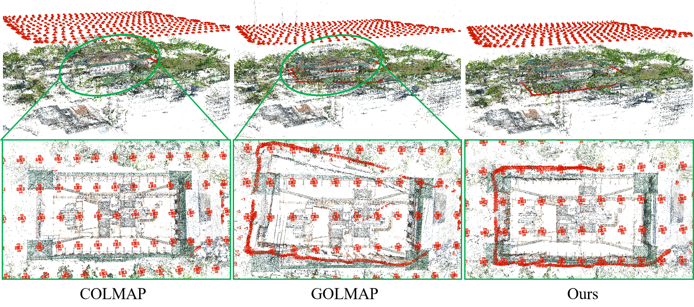

# A Geometric Consistency Constrained Hierarchical Global SfM for Large-Scale 3D Reconstruction

## About

This work integrates the feature track enhanced global SfM inside in divide-and-conquer framework.


## Getting Started
1. To build the project, first install projects in thirdparty [COLMAP](https://colmap.github.io/install.html#build-from-source) dependencies, using the following commands: 
```shell
cd thirdparty/colmap
mkdir build
cd build
cmake .. -GNinja
ninja && ninja install
```
2. After installation, one can install the project by 
```shell
mkdir build
cd build
cmake .. -GNinja
ninja && ninja install
```

Note:
- Our project depends on two external libraries - [COLMAP](https://github.com/colmap/colmap) and [PoseLib](https://github.com/PoseLib/PoseLib).


## Run
We first use colmap feature_extractor and matcher to obtain the database, then use hie_glomap to estimate the camera poses and point clouds.

```shell
colmap feature_extractor \
    --image_path    $DATASET_PATH/images \
    --database_path $DATASET_PATH/database.db

colmap exhaustive_matcher \
    --database_path $DATASET_PATH/database.db 

glomap/hie_glomap hie_mapper \
    --database_path $DATASET_PATH/database.db \
    --image_path $DATASET_PATH/images \
    --output_path $DATASET_PATH/models
```

For larger scale datasets, it is recommended to use `sequential_matcher` or
  `vocab_tree_matcher` from `COLMAP`.
```shell
colmap sequential_matcher --database_path DATABASE_PATH
colmap vocab_tree_matcher --database_path DATABASE_PATH --VocabTreeMatching.vocab_tree_path VOCAB_TREE_PATH
```
Please refer to [COLMAP](https://colmap.github.io/format.html#sparse-reconstruction) for more details.

Alternatively, one can use
  [hloc](https://github.com/cvg/Hierarchical-Localization/) for image retrieval
  and matching with learning-based descriptors.

### Visualize and use the results

The results are written out in the COLMAP sparse reconstruction format.

The reconstruction can be visualized using the COLMAP GUI, for example:
```shell
colmap gui --import_path ./output/south-building/sparse/0
```

## Datasets
### SYSU-UAV Dataset
The data can be retrieved at: https://pan.baidu.com/s/12NSCwwT4lapNCnIDb0ua4Q?pwd=anah 提取码: anah

## Acknowledgement

We are highly inspired by COLMAP, GLOMAP, PoseLib for their greate job. Please consider also citing
them, if using this in your work.


If you use this project for your research, please cite
```
@inproceedings{,
    author={Yan Zhou, Xianwei Zheng, Jinding Gao, Qian Shi, Xiaoping Liu},
    title={A Geometric Consistency Constrained Hierarchical Global SfM for Large-Scale 3D Reconstruction},
    booktitle={***},
    year={2025},
}
```